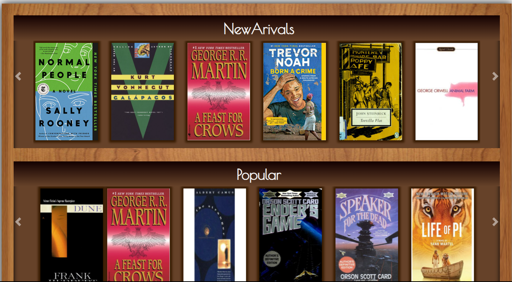
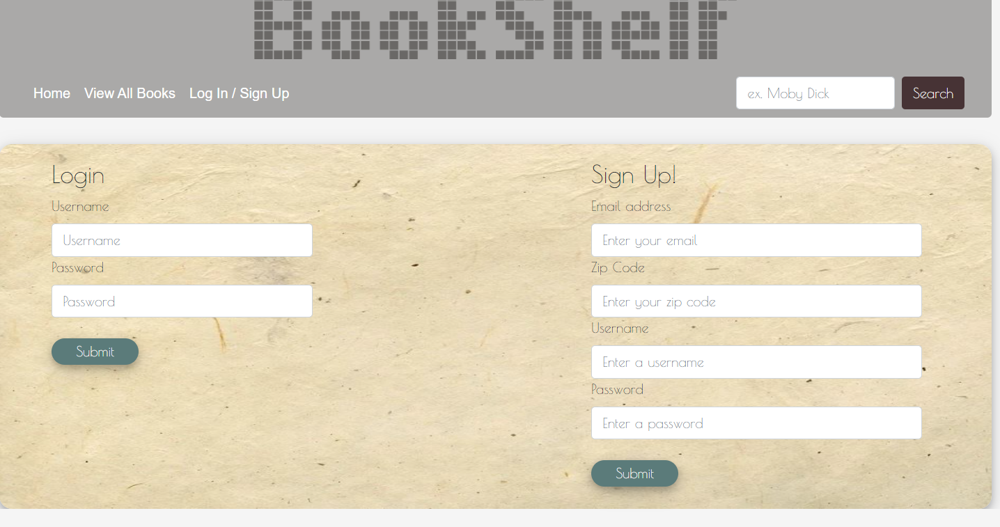
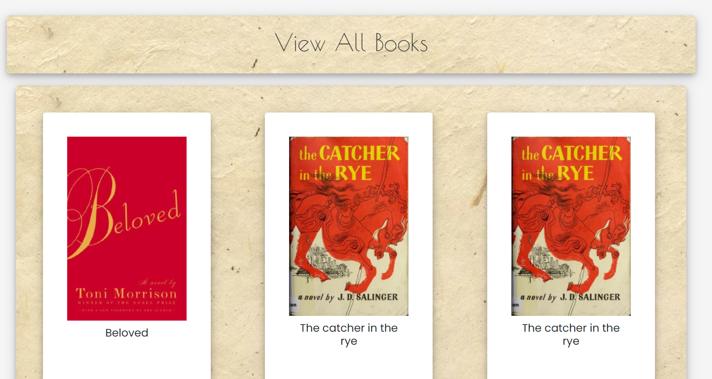
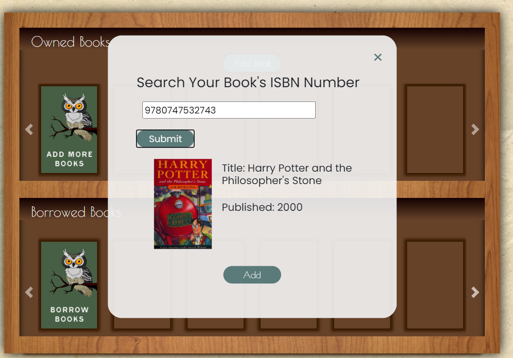

## Table of Contents

* [Description](#description)
* [Links](#links)
* [Screenshots](#screenshots)
* [Installation](#installation)
* [Usage](#usage)
* [Technologies Used](#technologies)
* [Collaborators](#collaborators)
* [Contributing](#contributing)
* [Questions](#questions)

## Description

An application where you can Borrow and Loan books with other users. Add your book's ISBN number to make it avaliable to loan. Search for books others have offered to loan

## Links

[See the Deployed BookShelf on Heroku](https://bookshelf-borrow-books.herokuapp.com/)

## Screenshots

Landing:

Login/Signup:

ViewAll:

Search:

## Installation Instructions

run "npm i" in the command line

## Usage

When you get to the landing page, you can browse through the collection however you first want to sign up. Although this isnt a real authentication process your user information will be added to our database and if it matches up you will be signed into your account where you can add more books to our database by catalouging it in our database. You can then add books you want to loan by adding them with the books ISBN number that can be found in the back of any book. Search and request books to loan from other users. 

This application follows the MVC file structure using Handlebars, Jquerry and Bootstrap.  

## Technologies Used

HTML, JQuerry, Handlebars, CSS, JSON, Express, noSQL, sequalize, APIs

## Collaborators

This app was built by Beni Mahat, Brenda, Cassino, Tessa, and Andy

## Contributing

Thank your to  Brenda, Cassino, Tessa, and Andy for collaborating with me on my second project as a web developer. 

We believe code is never finished, welcome your contributions to enhance the applications functionality. Please adhere to the Code of Conduct for the Contributer Covenant, version 2.0, at https://www.contributor-covenant.org/version/2/0/code_of_conduct.html.

## Questions

If you have further projects and questions, you can find me on Github: [GITHUB](https://github.com/benimahat1291). 
please visit my portfolio to find contact information: [BENI MAHAT](https://benimahat1291.github.io/Portfolio_v2/#/). 